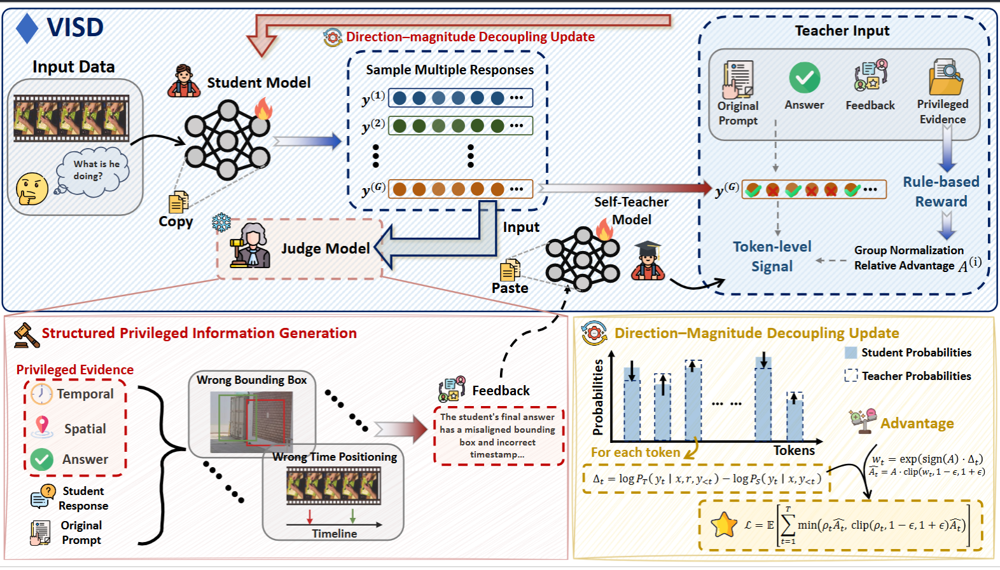
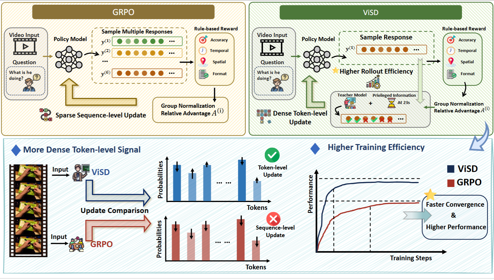
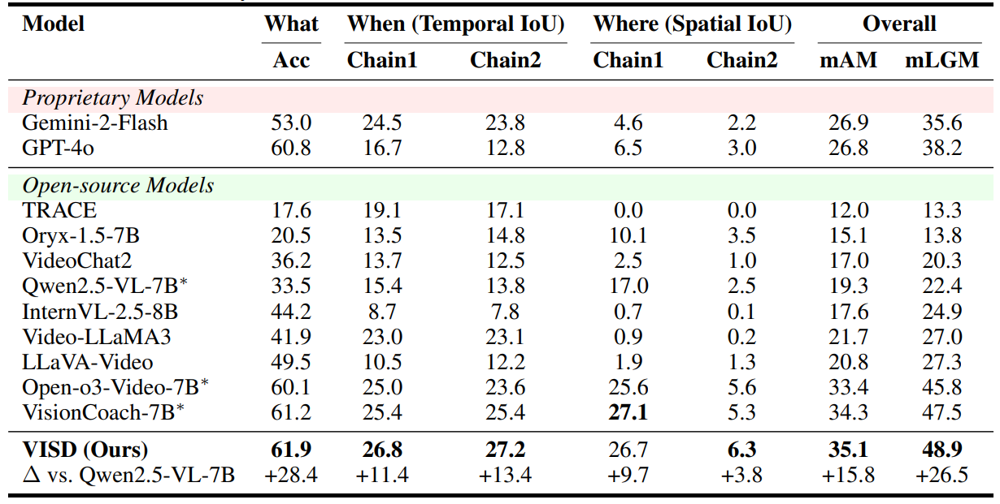

<div align="center">

# VISD: Enhancing Video Reasoning via Structured Self-Distillation

[](https://arxiv.org/abs/2605.06094)

</div>

## Updates

- (2026.05.16) Initial release of VISD (official implementation).

## Overview

<p align="center">
  
</p>

Training VideoLLMs for complex reasoning remains challenging due to sparse sequence-level rewards and the lack of fine-grained credit assignment over long, temporally grounded reasoning trajectories. While reinforcement learning with verifiable rewards (RLVR) provides reliable supervision, it fails to capture token-level contributions, leading to inefficient learning. Conversely, existing self-distillation methods offer dense supervision but lack structure and diagnostic specificity, and often interact unstably with reinforcement learning. In this work, we propose **VISD**, a structured self-distillation framework that introduces diagnostically meaningful privileged information for video reasoning. VISD employs a video-aware judge model to decompose reasoning quality into multiple dimensions, including answer correctness, logical consistency, and spatio-temporal grounding, and uses this structured feedback to guide a teacher policy for token-level supervision. To stably integrate dense supervision with RL, we adopt a direction-magnitude decoupling mechanism, where rollout-level advantages computed from rewards determine update direction, while structured privileged signals modulate token-level update magnitudes. This design enables semantically aligned and fine-grained credit assignment, improving both reasoning faithfulness and training efficiency. Additionally, VISD incorporates curriculum scheduling and EMA-based teacher stabilization to support robust optimization over long video sequences. Experiments on diverse benchmarks show that VISD consistently outperforms strong baselines, improving answer accuracy and spatio-temporal grounding quality. Notably, VISD reaches these gains with nearly **2x** faster convergence in optimization steps, highlighting the effectiveness of structured self supervision in improving both performance and sample efficiency for VideoLLMs.

## VISD vs. GRPO

Standard GRPO optimizes from sparse sequence-level rewards, which makes it difficult to identify which reasoning tokens improve or hurt long video trajectories. VISD keeps the reward-based update direction of GRPO, but uses structured feedback-conditioned teacher replay to assign fine-grained token-level credit, leading to more stable optimization, better grounding, and faster convergence in optimization steps.

<p align="center">
  
</p>

## Quick Start

### Environment setup

```bash
bash setup.sh
```

### Data preparation

This release includes the training annotation files:

```text
json_data/STGR-SFT.json
json_data/STGR-RL.json
```

Download the corresponding videos and model checkpoint from:

- [STGR / Open-o3-Video data](https://huggingface.co/datasets/marinero4972/Open-o3-Video)
- [SFT initialization model](https://huggingface.co/marinero4972/Open-o3-Video-SFT-7B)

The overall data structure should be:
```sh
DATA_ROOT
├── json_data
│   └── STGR-RL.json
│   └── STGR-SFT.json
└── videos
    └── gqa
    └── stgr
        └── plm
        └── temporal_grounding
    └── timerft
    └── treevgr
    └── tvg_r1
    └── videoespresso
    └── videor1
```

You should refine the DATA_ROOT in [`src/r1-v/configs/data_root.py`](src/r1-v/configs/data_root.py) according to your data path.
For more details on STGR data preparation, please refer to the [Open-o3-Video repository](https://github.com/marinero4972/Open-o3-Video).

Update local data paths according to your storage layout.

### Training

Edit paths and API settings in [`src/scripts/run_visd.sh`](src/scripts/run_visd.sh), then run:

```bash
bash src/scripts/run_visd.sh
```

### Evaluation

Edit model and data paths in `eval/scripts/`, then run:

```bash
bash eval/scripts/eval_all.sh
```

## Data and Evaluation Resources

Evaluation datasets:

- [V-STaR](https://huggingface.co/datasets/V-STaR-Bench/V-STaR)
- [Video-MME-v2](https://huggingface.co/datasets/MME-Benchmarks/Video-MME-v2)
- [VideoMMMU](https://huggingface.co/datasets/lmms-lab/VideoMMMU)
- [WorldSense](https://huggingface.co/datasets/honglyhly/WorldSense)
- [LongVideo-Reason](https://huggingface.co/datasets/LongVideo-Reason/longvideo_eval_videos)
- [Charades-STA](https://huggingface.co/datasets/lmms-lab/charades_sta)
- [TVG](https://huggingface.co/datasets/Boshenxx/TimeR1-Dataset)

External evaluation code:

- [Video-MME-v2](https://github.com/MME-Benchmarks/Video-MME-v2)
- [LongVideo-Reason](https://github.com/cyuQ1n/EasyVideoR1)
- [TVG / Charades-STA](https://github.com/xiaomi-research/time-r1)

## Main Results



Performance on the **V-STaR benchmark**, which evaluates spatio-temporal video reasoning across multiple compositional reasoning chains. **VISD** achieves **35.1 mAM** and **48.9 mLGM**, improving over the Qwen2.5-VL-7B baseline by **+15.8 mAM** and **+26.5 mLGM**. It also surpasses strong video reasoning models including **Open-o3-Video** and **VisionCoach**, while reaching strong performance with nearly **2x** faster convergence in optimization steps.

## Acknowledgements

We sincerely thank the following projects for their contributions to this work:

- [R1-V](https://github.com/StarsfieldAI/R1-V)
- [Open-o3-Video](https://github.com/marinero4972/Open-o3-Video)
- [VisionCoach](https://github.com/daeunni/VisionCoach)
- [Video-R1](https://github.com/tulerfeng/Video-R1)
- [Video-MME-v2](https://github.com/MME-Benchmarks/Video-MME-v2)
- [EasyVideoR1](https://github.com/cyuQ1n/EasyVideoR1)
- [Time-R1](https://github.com/xiaomi-research/time-r1)

We appreciate the developers and contributors of these projects for their excellent work and open-source contributions.

## Citation

If you use our work or our implementation in this repo, or find them helpful, please consider giving a citation in the following format.

```bibtex
@misc{lin2026visdenhancingvideoreasoning,
      title={VISD: Enhancing Video Reasoning via Structured Self-Distillation},
      author={Hao Lin and Kunyang Lv and Xu Jiang and Jingqi Tian and Zhongjing Du and Jiayu Ding and Qiaoman Zhang and Hongbo Jin},
      year={2026},
      eprint={2605.06094},
      archivePrefix={arXiv},
      primaryClass={cs.CV},
      url={https://arxiv.org/abs/2605.06094},
}
```
